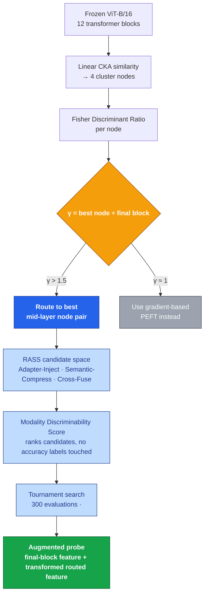
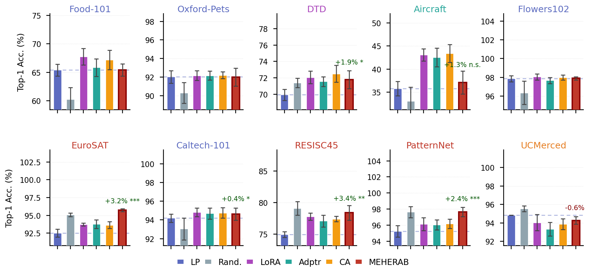

<div align="center">

# MEHERAB

### Zero-Gradient Mid-layer Evolutionary Homophilic Exploration for Remote-sensing Adaptation with Frozen Backbones

**WACV 2027 · Applications Track · Anonymous Submission**

[](LICENSE)
[](#)
[](#)

</div>

---

## Overview

Frozen vision transformers pretrained on ImageNet push discriminative information toward their final block — a structure that suits natural-image recognition but is often a poor match for the spectral and spatial regularities of remote-sensing imagery. **MEHERAB** asks a simple question: *is there a better feature already inside the frozen network, and can it be found without any gradient updates to the backbone?*

We answer this with the **FDR deficit ratio γ** — a ten-second diagnostic, computed from a small *labeled* proxy set (12.8–18.8% the size of the full training set on our headline datasets), that predicts when a frozen mid-layer feature beats the standard final-block linear probe — and **γ-guided routing to that mid-layer feature, refined by a lightweight zero-gradient search**, which together discover a 3-operation feature pathway beating both linear probing and gradient-based PEFT methods (LoRA, bottleneck adapters, CLIP-Adapter) trained on the same frozen features. A routing-only ablation shows routing recovers most of the achievable gain on our cleanest wins; the search's contribution is dataset-dependent, not uniform (paper Sec. 3.5).

## How it works



<sub>Dark blue = routing (does most of the work on our cleanest wins) · light blue = the search that refines it · full per-dataset breakdown in paper Sec. 3.5.</sub>

> **Note:** this diagram renders natively on GitHub. If your anonymous-review host doesn't support Mermaid, the numbered walkthrough in [Method, in brief](#method-in-brief) below covers the same pipeline in plain text.

<p align="center">
  
</p>

## Headline results

| Dataset | γ (deficit ratio) | Linear Probe | MEHERAB | Δ vs. LP |
|---|---|---|---|---|
| EuroSAT | 2.32× | 92.52% | **95.74%** | **+3.22 pp** (wins all 6 baselines, p<0.0125) |
| PatternNet | 2.46× | 95.24% | **97.66%** | **+2.42 pp** (wins all 6 baselines, p<0.0125) |
| RESISC45 | 1.78× | 74.94% | **78.38%** | **+3.44 pp** (p<0.0125 vs. LP) |
| Aircraft (fine-grained, γ≈1) | 1.00× | 35.78% | 37.10% | −5.98 pp vs. LoRA — γ correctly predicts this failure |

At low label counts (n=50, EuroSAT), MEHERAB reaches 82.6% while LoRA *drops below* plain linear probing (75.2% vs. 76.4% LP) — MEHERAB's fixed pathway doesn't overfit the way adapter parameters do.

### MEHERAB vs. gradient-based PEFT

| | LoRA / BnAdapter / CLIP-Adapter | MEHERAB |
|---|---|---|
| Retrain when label budget changes | Yes, full retrain | No — pathway discovered once, never retrained (Appendix B) |
| One-time cost per dataset | 80 gradient epochs × 5 seeds (Appendix D) | ≈3 min search, once, reused across 5 seeds (Sec. 3.5) |
| Where the paper recommends it | γ ≈ 1 (Sec. 1) | γ > 1.5 (Sec. 1) |

A single approximation–estimation decomposition (paper Sec. 3.6) explains all four outcome regimes below.

| Outcome regime | Driven by | Example |
|---|---|---|
| High-γ win | Proposition 1 — γ>1 ⟹ a strictly better probe exists inside the frozen network | EuroSAT, PatternNet |
| Near-ceiling failure | Corollary 1 — the achievable gain shrinks as the linear-probe baseline approaches ceiling | UCMerced (γ=1.73, still −0.56 pp) |
| Low-label advantage | Proposition 3 — adapters' extra parameters cost more than they're worth at small n | EuroSAT, n=50 |
| Universal single-edge structure | Proposition 2 — near-unit intra-cluster CKA makes any extra connection add zero synergy | All ten datasets |

## Method, in brief

1. **Task-conditional homophilic-graph construction** — cluster the 12 ViT-B/16 blocks via linear CKA similarity into 4 nodes; connect the two highest Fisher-Discriminant-Ratio nodes with a single edge — provably sufficient under near-unit intra-cluster CKA, since Proposition 2 shows any additional connection adds zero synergy.
2. **RASS operation search space** — three operation families (Adapter-Inject, Semantic-Compress, Cross-Fuse) over the selected node pair.
3. **Modality Discriminability Score (MDS)** — a zero-gradient proxy combining a task-alignment term and a model-change penalty, used to rank candidates without ever training a classifier to evaluate accuracy.
4. **Evolutionary search (Algorithm 1)** — tournament selection over 300 MDS evaluations (≈3 minutes on a single T4 GPU), once per dataset, reused across all evaluation seeds.

Which stage contributes more varies by dataset, not by a single rule of thumb: routing alone explains nearly all of the gain on PatternNet and most of it on EuroSAT, while on RESISC45 and UCMerced the RASS transform itself is essential — routing alone is statistically indistinguishable from (or worse than) the plain linear probe there. Full per-dataset numbers: paper Sec. 3.5.

See **[docs/METHOD.md](docs/METHOD.md)** for the full walkthrough with equation references, and **[docs/PAPER_MAP.md](docs/PAPER_MAP.md)** for an exact mapping from every paper equation, table, and figure to the file/function that implements or produces it.

## Repository structure

<details>
<summary><strong>Click to expand full tree</strong></summary>

```
meherab/
├── src/meherab/         Modular Python package
│   ├── config.py        All hyperparameters (single source of truth)
│   ├── backbone.py      Frozen ViT with per-block CLS hooks
│   ├── data/            Dataset loaders (10 benchmarks) + feature extraction
│   ├── graph/           CKA, Fisher Discriminant Ratio, homophilic-graph construction
│   ├── rass/            RASS operations + leakage-safe feature transform
│   ├── search/          MDS, NASWOT/SynFlow-adapted proxies, evolutionary search
│   ├── baselines/       LoRA, bottleneck adapter, CLIP-Adapter
│   ├── eval/            Evaluation probe, proxy validation, significance testing
│   └── viz/             WACV-standard figure style and color palette
├── scripts/
│   └── run_main_experiment.py   Reproduces Table 1 end-to-end
├── notebooks/
│   └── meherab_pipeline.py      The complete original pipeline (every table + figure)
├── configs/
│   └── default.yaml     YAML mirror of MEHERABConfig
├── tests/                22 unit tests covering every core mathematical claim
├── docs/
│   ├── METHOD.md         Theory walkthrough
│   ├── REPRODUCING.md    Step-by-step reproduction instructions
│   └── PAPER_MAP.md      Paper equation/table/figure ↔ code mapping
├── figures/              14 paper figures, PDF + PNG, camera-ready formatting
├── results/              all_results.json, figure_data.json, 5 result tables (CSV)
├── pyproject.toml / environment.yml
├── LICENSE
└── CITATION.cff
```

</details>

## Installation

```bash
pip install -e .
```

or with conda:

```bash
conda env create -f environment.yml && conda activate meherab
```

## Quickstart

**Verify the installation** (no GPU, no dataset downloads, ~5 seconds):

```bash
pip install -e ".[dev]"
pytest tests/ -v
```

**Reproduce Table 1** (the full 10-dataset × 6-method benchmark, ~1–1.5 hours on a T4 GPU):

```bash
python scripts/run_main_experiment.py --output-dir outputs/
```

**Reproduce every table and figure in the paper** (backbone generalisation, few-shot, cross-domain transfer, ablations):

```bash
python notebooks/meherab_pipeline.py
```

Full instructions, expected runtimes, and how to verify your run against the included reference results: **[docs/REPRODUCING.md](docs/REPRODUCING.md)**.

**Hardware.** All timings above are measured on a single T4 GPU with 15.6 GB VRAM (paper Appendix D).

**Reproducibility note.** The evolutionary search is stochastic. The paper describes its own reported numbers as *"one representative outcome of a stochastic search, not a guaranteed optimum"* (Sec. 8) — exact reproduction of every discovered pathway on a re-run isn't guaranteed, even though the reported accuracies were obtained this way.

## Results data

- `results/all_results.json` — raw per-seed accuracies for all 10 datasets × 6 methods, plus discovered RASS operations, MDS scores, and search dynamics.
- `results/figure_data.json` — fully serialized state used to regenerate every figure.
- `results/tables/` — camera-ready CSV exports of every paper table (main results, proxy validation, significance tests, discovered pathways, compute profile).

## Citation

```bibtex
@inproceedings{anonymous2027meherab,
  title     = {Zero-Gradient Mid-layer Evolutionary Homophilic Exploration
               for Remote-sensing Adaptation with Frozen Backbones},
  author    = {Anonymous},
  booktitle = {IEEE/CVF Winter Conference on Applications of Computer
               Vision (WACV)},
  year      = {2027},
  note      = {Under review}
}
```

## License

Released under the [MIT License](LICENSE).
